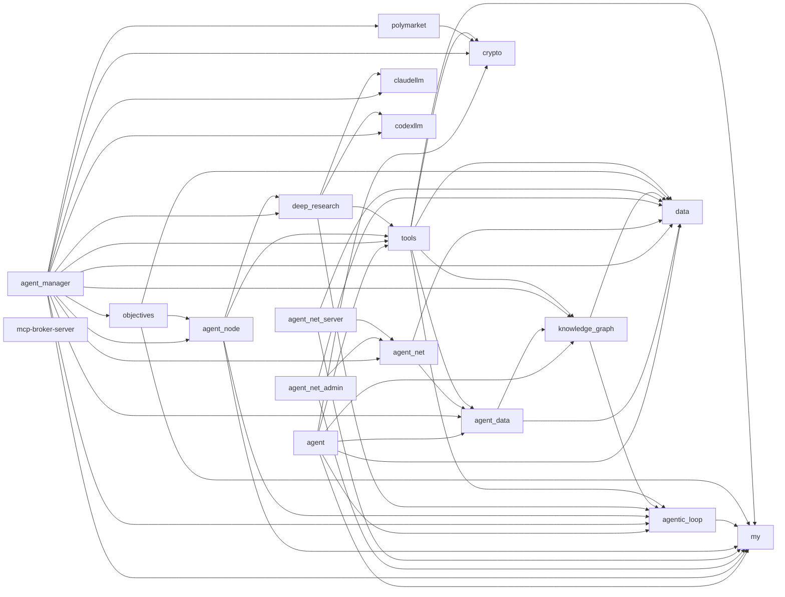

# Module Dependency Diagram

Generated from `go.mod` files (direct module dependencies only). Excludes `vendor/` and `examples/`.

```mermaid
flowchart LR
  agent --> agent_data
  agent --> agentic_loop
  agent --> crypto
  agent --> data
  agent --> knowledge_graph
  agent --> my
  agent --> tools
  agent_data --> data
  agent_data --> knowledge_graph
  agent_manager --> agent_data
  agent_manager --> agent_net
  agent_manager --> agent_node
  agent_manager --> agentic_loop
  agent_manager --> claudellm
  agent_manager --> codexllm
  agent_manager --> crypto
  agent_manager --> data
  agent_manager --> deep_research
  agent_manager --> knowledge_graph
  agent_manager --> my
  agent_manager --> objectives
  agent_manager --> polymarket
  agent_manager --> tools
  agent_net --> agent_data
  agent_net --> data
  agent_net_admin --> agent_net
  agent_net_admin --> data
  agent_net_admin --> my
  agent_net_server --> agent_net
  agent_net_server --> data
  agent_net_server --> my
  agent_node --> agentic_loop
  agent_node --> deep_research
  agent_node --> my
  agent_node --> tools
  agentic_loop --> my
  claudellm["claudellm"]
  codexllm["codexllm"]
  crypto["crypto"]
  data["data"]
  deep_research --> agentic_loop
  deep_research --> claudellm
  deep_research --> codexllm
  deep_research --> tools
  knowledge_graph --> agentic_loop
  knowledge_graph --> data
  mcp-broker-server["mcp-broker-server"]
  my["my"]
  objectives --> agent_node
  objectives --> data
  objectives --> my
  polymarket --> crypto
  tools --> agent_data
  tools --> agentic_loop
  tools --> crypto
  tools --> data
  tools --> knowledge_graph
  tools --> my
```

Regenerate with:
`./scripts/gen_module_deps.sh`
